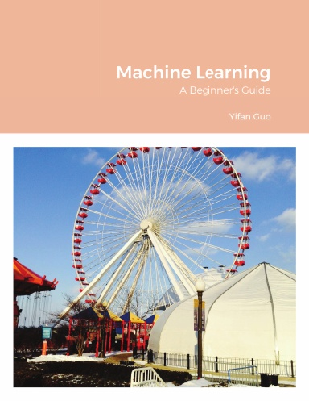

# Machine Learning: A Beginner's Guide

## Description
This 117-page book introduces readers to the field of machine learning and broader data science. Using simple examples and engaging illustrations, this 117-page book explains important concepts data scientists use to extract insights from data.

## Objectives
Without data intelligence and enterprise-scale machine learning, most corporations would
not be able to accomplish their goals. Mastery in this area requires a highly skilled and curious
workforce that starts with America's next generation. This guide is therefore intended to introduce
primary and secondary school students interested in a career in STEM about the field of machine
learning and data science.

## Motivation
I wrote this book for a few reasons.
- First, I always found it fun to teach others. Teaching is one way to build personal relationships and trust.
- Second, the pandemic gave me additional spare time. Since I no longer had to go into the office, I decided to use that extra time to do something productive.
- Third, I learned that knowledge that is not used or written down eventually disappears. If I wanted to impart my learnings I worked so hard to gain in college and beyond, I must put my knowledge to paper. Writing this book actually forced me to learn more about machine learning, review areas I was rusty, and research new topics.

